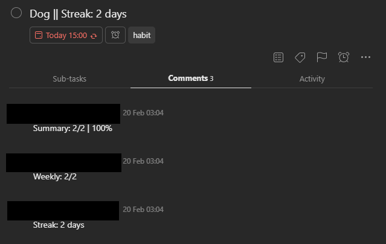

# habitist 
An automation to enable habit tracking in todoist. Original implementation at -[amitness:habitist](https://github.com/amitness/habitist). This version extends the functionality slightly.

It integrates a habit tracker for habit building into [todoist](http://todoist.com/). Once it's setup, you can forget about it and it works seamlessly.  

Helps keep track of habits.

Maintains 3 metrics:

    1. Current Streak (X days)
    2. Summary (X/Y | Z%)
    3. Weekly (X/Y)

Metrics are updated if you complete a task on an off-day (set in Todoist settings), but not updated if you do not complete a habit on an off-day. Task will be rescheduled either way. 

## Usage

1. You add habits you want to form as task on todoist with schedule `every day`

2. Add the label `habit` to the task

3. If you complete the task, the metrics will update at midnight the next day

4. If you fail to complete the task and it becomes overdue, the script will schedule it to today and reset the streak to 0 days.

## Setup Instructions
1. You will need a GitHub account to setup this for your use. Please signup from [here](https://github.com/join) if you don't have an account yet. 

2. Once logged in to GitHub, [fork](https://github.com/amitness/habitist/fork) this repo to your GitHub account.  

3. Find the Todoist API key for your account from `Settings > Integrations` from [here](https://todoist.com/prefs/integrations).  

4. Goto `https://github.com/amitness/habitist/settings/secrets` by replacing `amitness` with your GitHub username. Click the `New Secret` button and add the key you got from step 3 as shown below.

    

5. We want to trigger this once the day ends. So, you will need to find the time in UTC when it's 12 AM in your country.
> For example, Nepal is 5:45 hrs ahead of UTC. For 12:00 AM in Nepal, UTC time will be 6:15 pm i.e. 18:15.

You can use [https://www.thetimezoneconverter.com](https://www.thetimezoneconverter.com/) to do it. As seen in screenshot, you just need to type 00:00 in the local time and select the `24` hour button. Note the time you get in the UTC column (i.e. 18:15 in below example)

    

6. Now, you need to go to `./github/workflows/pythonapp.yml` file in the repo and edit the `cron` key under `schedule` to the time you got in previous step. Just modify the first 2 numbers. The first number would be minutes and the second number would be hours. If you got `18:15` as the time in previous step, it would be `15 18 * * *`

    

7. Ensure that actions are enabled by going to `settings/actions` and enabling all actions

8. If everything is setup correctly, the streak on the tasks will automatically increase/decrease on the next day.

## Forks
- [srpoyrek: habitist](https://github.com/srpoyrek/habitist) has developed a fork where you can schedule the task to be deleted after reaching a goal. 

## License

This project is licensed under the MIT License - see the [LICENSE](LICENSE) file for details
